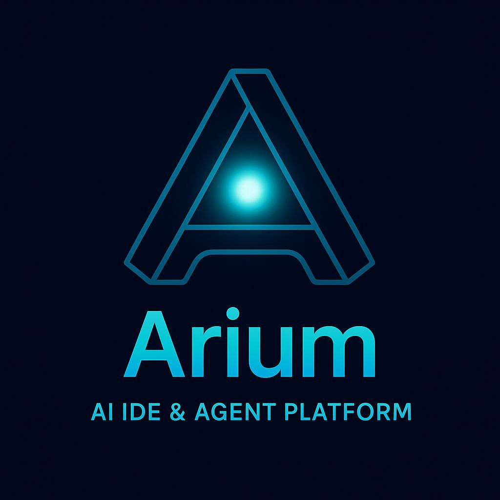

<p align="center">  
    
</p>

# Arium — AI-Powered IDE & Agent Platform

**Multi-Model Reasoning • Tool Engine • Virtual File System • Autonomous Code Agents**

Arium is a local-first, modular AI IDE that unifies code editing, autonomous agents, an extensible tool engine, and multi-model adapters into a single developer environment.

Designed for engineers, creators, and research teams who want reproducible, auditable, secure AI-driven development workflows.

---

## 🧑‍💻 Authors & Core Development Team

### Primary Authors

- **Bogdan Marcen** — Founder & Lead Developer  
  Vision, architecture, engineering, core system design.

- **ChatGPT 5.1** — AI Architect & Co-Developer  
  System architecture, specifications, documentation, reasoning engine design.

> Arium was shaped by a deep human–AI collaboration built on trust, creativity, and shared engineering intuition.

---

## Table of Contents

- [Vision](#vision)
- [Key Features](#key-features)
- [Architecture Overview](#architecture-overview)
- [Core Concepts & Components](#core-concepts--components)
- [Repository Layout](#repository-layout)
- [Quickstart / Developer Setup](#quickstart--developer-setup)
- [Configuration & Environment](#configuration--environment)
- [Tool Definition Example (JSON)](#tool-definition-example-json)
- [Agent Configuration Example](#agent-configuration-example)
- [Security & Sandboxing](#security--sandboxing)
- [Extensibility & Plugins](#extensibility--plugins)
- [Roadmap & Priorities](#roadmap--priorities)
- [How to Contribute](#how-to-contribute)
- [License & Credits](#license--credits)
- [Contact](#contact)

---

## Vision

Arium empowers developers to build, test and run AI agents that can reason about code, orchestrate tools, and produce reproducible changes — while keeping control over data, execution, and models.

The platform is local-first, audit-friendly, and extensible for both research and production use.

---

## Key Features

### ✅ **Fully Implemented**

- **🔄 Event Bus**: Append-only event log, real-time WebSocket streaming, full audit trail
- **💾 Persistent Storage**: Disk-based storage for events and files, automatic recovery
- **🔧 Tool Engine**: 
  - 9+ built-in tools (fs.read, fs.write, fs.delete, vfs.snapshot, system.hash, etc.)
  - Sandboxed JavaScript runner (VM2)
  - Sandboxed Python runner (subprocess isolation)
  - Schema validation, permission matrix
- **🤖 Model Adapters**: 
  - ✅ OpenAI (GPT-4, GPT-4o, GPT-4o-mini) with native function calling
  - ✅ Ollama (Llama 2, Mistral, CodeLlama, etc.) for local-first
  - ✅ MockAdapter for testing
- **🧠 Agent Core**: Multi-step reasoning loop, tool orchestration, context management
- **📁 Virtual File System**: Versioning, snapshots, diff engine, persistent storage
- **🌐 REST API**: Full HTTP API for agents, VFS, tools, and events
- **⚡ WebSocket**: Real-time event streaming to UI clients

### 🚧 **Planned**

- **🎨 UI Shell**: React-based frontend (structure prepared)
- **🔐 Advanced Security**: RBAC, encryption, advanced sandboxing
- **🔌 Plugin System**: Marketplace for tools and extensions
- **📦 Git Integration**: Version control operations
- **🌍 Collaborative Features**: Multi-user workspaces

---

## Current Status

**Version:** 0.1.0 (MVP)

The core runtime is **fully functional** and ready for development:
- ✅ All core systems implemented
- ✅ REST API + WebSocket server
- ✅ Multiple model adapters
- ✅ Sandboxed tool execution
- ✅ Persistent storage
- ✅ Complete documentation
- 🚧 UI frontend (structure ready)
- 🚧 Advanced features (roadmap)

---

## Architecture Overview

Arium consists of six primary subsystems:

1. **UI Shell (React)** — planned
2. **Project Workspace**
3. **Virtual File System (VFS)**
4. **Tool Engine**
5. **Agent Core (Reasoning)**
6. **Model Adapter Layer**

All modules communicate through the **Arium Event Bus**, an event-driven pub/sub system enabling loose coupling and full auditability.

📊 **Architecture Diagrams**: See [assets/diagrams/](./assets/diagrams/) for visual architecture diagrams.

---

## Core Concepts & Components

### Arium Event Bus

Centralized event stream for prompts, model responses, tool calls, VFS changes, and security checks.

- Typed events stored in `workspace/{projectId}/history.log`.
- Append-only for guaranteed audit trails.

---

### Project Workspace & VFS

A project contains:

- `files`
- `tools`
- `agent configuration`
- `metadata`
- `history`

**VFS Features:**

- hierarchical file structure
- lightweight versioning
- diff engine
- local/cloud FS connectors
- autosave and snapshot system

---

### Tool Engine

Tools are declared in JSON or YAML.

**Tool Runners:**

- `js-runner` (Node/Deno sandbox)
- `py-runner` (Python sandbox)
- `builtin` (internal primitives)

**Tool lifecycle:**

1. Validation
2. Permission checking
3. Sandboxed execution
4. Structured output
5. Event Bus reporting

---

### Agent Core (Reasoning Loop)

**Capabilities:**

- single-step mode
- iterative reasoning (multi-step loop)
- auto-planning
- task decomposition
- chain-of-tools orchestration
- code-aware reasoning

**Components:**

- `planner.ts`
- `memory.ts`
- `fc-handler.ts`
- `history.ts`

---

### Model Adapter Layer

Unified interface for all LLM providers:

```typescript
interface AriumModel {  
  generate(prompt: string, options?: object): Promise<ModelResponse>;  
  stream(prompt: string, options?: object): AsyncGenerator<ModelStreamChunk>;  
  tools?: ToolSpec[];  
}  
```

**Adapters for:**

- OpenAI
- Gemini
- Ollama
- Local TGI servers
- Custom endpoints

---

## Repository Layout

```
arium/
├── src/                # Core implementation
│   ├── core/           # Core engines
│   │   ├── agent/      # Agent Core (reasoning loop, planner)
│   │   ├── eventBus.ts # Event Bus system
│   │   ├── models/     # Model adapters (OpenAI, Ollama, Mock)
│   │   ├── tool-engine/# Tool Engine + Runners (JS, Python)
│   │   ├── tools/      # Built-in tools
│   │   ├── vfs/        # Virtual File System
│   │   └── storage/    # Persistent storage (EventBus, VFS)
│   │
│   ├── server/         # Backend server
│   │   ├── http.ts     # REST API (Express)
│   │   ├── websocket.ts# WebSocket server
│   │   └── routes/     # API routes (agent, vfs, events, tools)
│   │
│   └── index.ts        # Main entry point
│
├── app/                # Frontend (React) - planned
│   ├── public/
│   └── src/
│       ├── components/
│       ├── editors/
│       ├── console/
│       └── store/
│
├── docs/               # Documentation
│   ├── architecture.md
│   ├── agent-core.md
│   ├── tool-engine.md
│   ├── core-systems.md
│   ├── openai-adapter.md
│   ├── ollama-adapter.md
│   ├── js-runner.md
│   ├── python-runner.md
│   ├── persistent-storage.md
│   ├── builtin-tools.md
│   └── server-api.md
│
├── assets/
│   ├── logo.png
│   └── diagrams/       # SVG architecture diagrams
│
├── core/               # Legacy placeholders (can be removed)
├── server/             # Legacy placeholder
│
├── LICENSE             # Apache-2.0
├── CONTRIBUTING.md
├── QUICKSTART.md
├── package.json
├── tsconfig.json
└── README.md
```

---

## Quickstart / Developer Setup

### Prerequisites

- **Node.js 18+**
- **npm** or **pnpm**
- **Python 3.10+** (optional, for Python runner)
- **Ollama** (optional, for local LLM models)

### Installation

```bash
# Clone repository
git clone https://github.com/BOHDANMARCEN/Arium-AI-Powered-IDE-Agent-Platform.git
cd Arium-AI-Powered-IDE-Agent-Platform

# Install dependencies
npm install

# Configure environment (optional)
cp .env.example .env
# Edit .env and add your API keys if needed
```

### Running

#### Development Mode

```bash
npm run dev
```

This starts:
- **REST API** on `http://localhost:4000`
- **WebSocket** on `ws://localhost:4000`
- **Event Bus** with real-time event streaming
- **Persistent storage** (if enabled)

#### Production Build

```bash
npm run build
npm start
```

### First Steps

1. **Test the API:**
   ```bash
   curl http://localhost:4000/tools/list
   ```

2. **Run an agent task:**
   ```bash
   curl -X POST http://localhost:4000/agent/run \
     -H "Content-Type: application/json" \
     -d '{"input": "List all files in VFS"}'
   ```

3. **Connect via WebSocket** to see real-time events:
   ```javascript
   const ws = new WebSocket('ws://localhost:4000');
   ws.onmessage = (event) => console.log(JSON.parse(event.data));
   ```

See [QUICKSTART.md](./QUICKSTART.md) for detailed instructions.

---

## Configuration & Environment

Create a `.env` file in the root directory:

```env
# Model Adapters
OPENAI_API_KEY=sk-xxxx              # Optional: Use OpenAI models
OPENAI_MODEL=gpt-4o-mini
USE_OLLAMA=true                     # Optional: Use Ollama (local models)
OLLAMA_URL=http://localhost:11434
OLLAMA_MODEL=llama2

# Server Configuration
PORT=4000

# Storage
PERSISTENT_STORAGE=true             # Enable disk persistence
WORKSPACE_PATH=./workspace
PROJECT_ID=default

# Sandbox Settings
SANDBOX_MAX_RUNTIME_MS=30000
SANDBOX_MAX_MEMORY_MB=256
```

**Model Adapter Priority:**
1. OpenAI (if `OPENAI_API_KEY` is set)
2. Ollama (if `USE_OLLAMA=true` and Ollama is available)
3. MockAdapter (fallback for testing)

See [docs/openai-adapter.md](./docs/openai-adapter.md) and [docs/ollama-adapter.md](./docs/ollama-adapter.md) for details.

---

## Tool Definition Example

### Built-in Tool

Built-in tools are registered automatically:

```typescript
// Already registered: fs.read, fs.write, fs.delete, fs.list, 
// vfs.diff, vfs.snapshot, system.hash, system.info, text.process
```

### JavaScript Tool

```typescript
toolEngine.register({
  id: "my-js-tool",
  name: "My JS Tool",
  runner: "js",
  schema: {
    type: "object",
    properties: { text: { type: "string" } },
    required: ["text"]
  }
}, `
  export default async function run(args) {
    return { ok: true, data: args.text.toUpperCase() };
  }
`);
```

### Python Tool

```typescript
toolEngine.register({
  id: "my-python-tool",
  name: "My Python Tool",
  runner: "py",
  schema: {
    type: "object",
    properties: { text: { type: "string" } },
    required: ["text"]
  }
}, `
def run(args):
    return {"ok": True, "data": args["text"].upper()}
`);
```

See [docs/builtin-tools.md](./docs/builtin-tools.md) for the full list of built-in tools.

---

## Agent Configuration Example

```json
{
  "id": "default-agent",
  "name": "Code Assistant",
  "mode": "reasoning-loop",
  "model": {
    "adapter": "openai",
    "model": "gpt-4o-mini",
    "temperature": 0.0
  },
  "memory": {
    "type": "ephemeral",
    "max_tokens": 1024
  },
  "stop_conditions": {
    "max_steps": 20,
    "success_criteria": ["tests_passed", "task_confirmed"]
  }
}
```

---

## Security & Sandboxing

Arium enforces strict security boundaries:

- Permission matrix
- FS scoping
- Tool sandboxing
- Injection detection
- Append-only audit trail

---

## Extensibility & Plugins

Plugin system supports:

- UI extensions
- custom tools
- model adapters
- workspace connectors

---

## Roadmap & Priorities

### ✅ Phase 1 (MVP) - **COMPLETED**

- ✅ Core VFS with versioning
- ✅ Tool Engine with validation
- ✅ Agent Core (reasoning-loop)
- ✅ OpenAI adapter
- ✅ Ollama adapter
- ✅ Sandboxed JS runner
- ✅ Sandboxed Python runner
- ✅ Persistent storage
- ✅ REST API + WebSocket
- ✅ Built-in tools (9+)
- 🚧 Base UI Shell (structure ready)

### 🔄 Phase 2 - **IN PROGRESS**

- ✅ Python/JS sandbox
- ✅ Model switching (OpenAI/Ollama/Mock)
- 🚧 Diff editor
- 🚧 Tool marketplace
- 🚧 Enhanced VFS features

### 📅 Phase 3 - **PLANNED**

- Git integration
- Advanced observability
- Plugin marketplace
- Collaborative sync

### 📅 Phase 4 - **FUTURE**

- RBAC (Role-Based Access Control)
- Enterprise backend
- Advanced security features
- Distributed execution

---

## API Documentation

### REST API Endpoints

- `POST /agent/run` - Run agent task
- `GET /vfs/list` - List files
- `GET /vfs/read?path=...` - Read file
- `POST /vfs/write` - Write file
- `GET /events/history` - Event history
- `GET /tools/list` - List tools
- `POST /tools/invoke` - Invoke tool

### WebSocket

Connect to `ws://localhost:4000` for real-time event streaming.

See [docs/server-api.md](./docs/server-api.md) for complete API documentation.

---

## Documentation

- **[Architecture](./docs/architecture.md)** - System architecture overview
- **[Agent Core](./docs/agent-core.md)** - Reasoning engine details
- **[Tool Engine](./docs/tool-engine.md)** - Tool system specification
- **[Core Systems](./docs/core-systems.md)** - Event Bus, VFS, Model Adapters
- **[OpenAI Adapter](./docs/openai-adapter.md)** - Using OpenAI models
- **[Ollama Adapter](./docs/ollama-adapter.md)** - Using local models
- **[JS Runner](./docs/js-runner.md)** - JavaScript tool execution
- **[Python Runner](./docs/python-runner.md)** - Python tool execution
- **[Persistent Storage](./docs/persistent-storage.md)** - Disk storage system
- **[Built-in Tools](./docs/builtin-tools.md)** - Available tools
- **[Server API](./docs/server-api.md)** - REST & WebSocket API
- **[Quick Start](./QUICKSTART.md)** - Getting started guide

---

## How to Contribute

1. Fork the repository
2. Create a feature branch (`git checkout -b feat/amazing-feature`)
3. Commit your changes (`git commit -m 'feat: Add amazing feature'`)
4. Push to the branch (`git push origin feat/amazing-feature`)
5. Open a Pull Request

Please follow [CONTRIBUTING.md](./CONTRIBUTING.md) for coding standards and guidelines.

---

## Examples

### Using OpenAI

```bash
# Set API key
export OPENAI_API_KEY=sk-...

# Start server
npm run dev

# Run agent
curl -X POST http://localhost:4000/agent/run \
  -H "Content-Type: application/json" \
  -d '{"input": "Create a hello world file"}'
```

### Using Ollama (Local)

```bash
# Install Ollama
curl -fsSL https://ollama.ai/install.sh | sh

# Pull model
ollama pull llama2

# Start Ollama
ollama serve

# Configure Arium
export USE_OLLAMA=true
export OLLAMA_MODEL=llama2

# Start Arium
npm run dev
```

### Creating Custom Tools

See [docs/js-runner.md](./docs/js-runner.md) and [docs/python-runner.md](./docs/python-runner.md) for examples.

---

## Project Status


**Current Focus:** Core runtime is stable. Next: UI Shell and advanced features.

---

## License & Credits

Arium is distributed under **Apache License 2.0**.

Copyright (c) 2024 Bogdan Marcen

---

## Contact

- **GitHub Issues**: [Report bugs or request features](https://github.com/BOHDANMARCEN/Arium-AI-Powered-IDE-Agent-Platform/issues)
- **Repository**: [BOHDANMARCEN/Arium-AI-Powered-IDE-Agent-Platform](https://github.com/BOHDANMARCEN/Arium-AI-Powered-IDE-Agent-Platform)

For collaboration, ideas, or questions — please open a GitHub issue or discussion.

