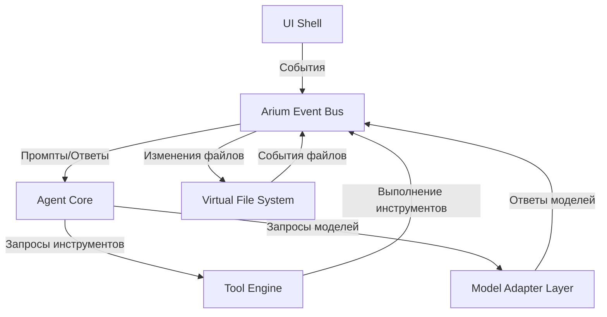

# Анализ архитектуры Arium

## Диаграмма архитектуры

## Основные компоненты

1. **Event Bus** - Центральная шина событий для всех взаимодействий
2. **Agent Core** - Ядро агента с циклом рассуждений
3. **Tool Engine** - Система управления и выполнения инструментов
4. **Model Adapter Layer** - Абстракция для работы с различными моделями
5. **Virtual File System** - Виртуальная файловая система с версионированием

## Потенциальные проблемы и узкие места

1. **Производительность Event Bus**: При большом количестве событий может возникнуть проблема с производительностью
2. **Ограничения Tool Engine**: Текущая реализация не поддерживает параллельное выполнение инструментов
3. **Масштабируемость Model Adapter**: При работе с несколькими моделями одновременно могут возникнуть проблемы с управлением ресурсами
4. **Безопасность VFS**: Требуется дополнительная проверка безопасности при работе с файлами
5. **Обработка ошибок в Agent Core**: Текущая реализация может не полностью обрабатывать все возможные ошибки

## Предложения по улучшению

1. **Оптимизация Event Bus**: Внедрить механизм батчинга событий
2. **Параллельное выполнение инструментов**: Добавить поддержку асинхронного выполнения
3. **Улучшенное управление моделями**: Реализовать пул соединений для моделей
4. **Усиление безопасности VFS**: Добавить дополнительные проверки и ограничения
5. **Улучшенная обработка ошибок**: Расширить систему обработки ошибок в Agent Core